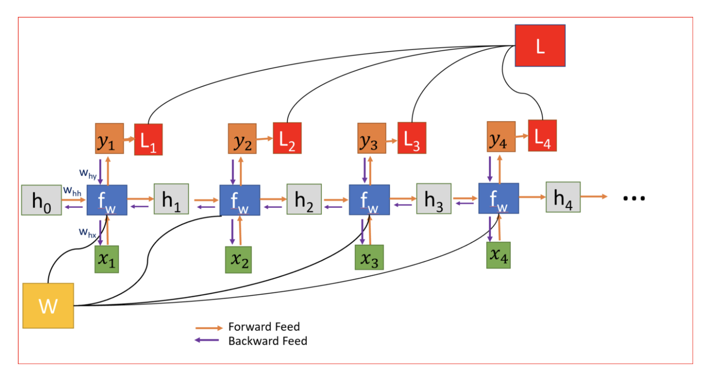
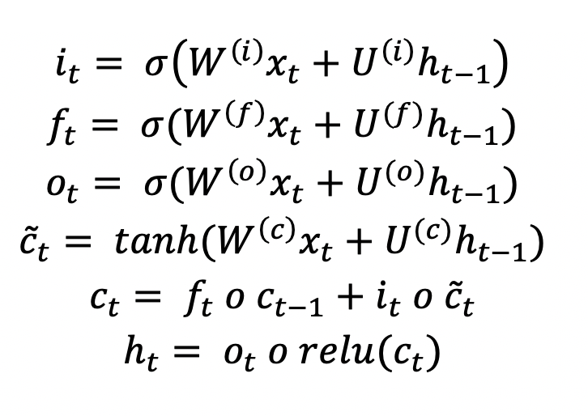

# Predict Future Sales
The Kaggle competition [link](https://www.kaggle.com/c/competitive-data-science-predict-future-sales)

## Competition Goal
The task is to forecast the total amount of products sold in every shop for the test set. Submissions are evaluated by root mean squared error (RMSE).
## Dataset
You are provided with daily historical sales data.  
**File descriptions**
  - sales_train.csv - the training set. Daily historical data from January 2013 to October 2015.
  - test.csv - the test set. You need to forecast the sales for these shops and products for November 2015.
  - items.csv - supplemental information about the items/products.
  - item_categories.csv  - supplemental information about the items categories.
  - shops.csv- supplemental information about the shops.
## Achievement
The final rmse metric is 1.08. I ranked top 56% out of 8,766 competitors.
## Approach
### Analytics
  - Look into Top5 items count from 2013 to 2015. Use plotly to generate interactive plot for data visualization.
  - Youtube link  (plotly-animation plot)

  

### modelling
#### XGBoost
  - Data Preprocessing
    - datetime
    - sum up sales on a monthly basis
    - Remove outliers
    - fill the month num without item_cnt_day sum with 0 value
    - Fill the nan value
  - Features
      - **seasonality:** month, date_cat_avg_item_cnt, date_block_num, item_cnt_month
      - **shops:** date_shop_cat_avg_item_cnt
      - **items:** item_category_id, delta_price_lag, item_id, date_cat_avg_item_cnt, date_item_avg_item_cnt, item_avg_item_price, date_item_avg_item_price, price_change_percent

  - Model (XGBoost)
    - Train data -- week 0-32
    - Valid data -- week 33
  - Post Process Approach
    - Take 25% high (shop,item) tuple with item_cnt_month, (median of last 4 or 5 month in last year), replace the pred value with the median and clip (0,20)
    - take the median value of all shop and items from first to last year, get all (items, shop) for median with 0, replace their value with 0 &
    - take the tuple not appear in train set but in test set, replace the pred val with 0

#### multivariate_LSTM
  - Data Preprocessing
    - fill the (shop, item) tuple set with 0 during training period when there are no sales_train
    - fill the (shop, item) tuple set with 0 during validatoin period when there are no sales_train
  - Features
    - item average price, shop_item_sum on monthly and yearly basis, items sold count on monthly basis, total items sold sold on monthly basis,
    - **time lag features:**
      - sum up shop total items sold every month on previous 1, 2, 3 ,and 6 months
      - sum up item total sold count every month on previous 1, 2, 3 ,and 6 months
  - ttl training feature shape: (1175113, 22)
  - input feature shape (1019418, 1, 21)
    - (# num of samples, # num of time steps, # num of features)

  - modelling   
      
      

    LSTM solves **Vanishing Gradient Problem**, which shows that gradient shrink exponentially and have small values near 0. LSTM both have a gating mechanism to regulate the flow of information like remembering the context over multiple time steps. There are **Input gate**, **Forget Gate**, and **Output Gate**
    - Input gate: update the cell state. When it's 0, it would not update the cell state. When it's 1, it would update the cell, meaning data is important.
    - Forget Gate: Keep or drop information from the previous hidden state. When it's open (1), it keeps the previous dataset. On the other hand, when it's close, it updates the new data and drop the past data.
    - Output Gate: The output gate decides what the next hidden state should be. Hidden state contains information on previous inputs and is used for prediction.

    First, we pass the previous hidden state and the current input into a sigmoid function. Then we pass the newly modified cell state to the tanh function. We multiply the tanh output with the sigmoid output to decide what information the hidden state should carry. The output is the hidden state.

  - Final output
    - Training mse: 0.0237
    - Training mae: 0.0562
    - Validation mse: 0.0410
    - Validation mae: 0.0281
